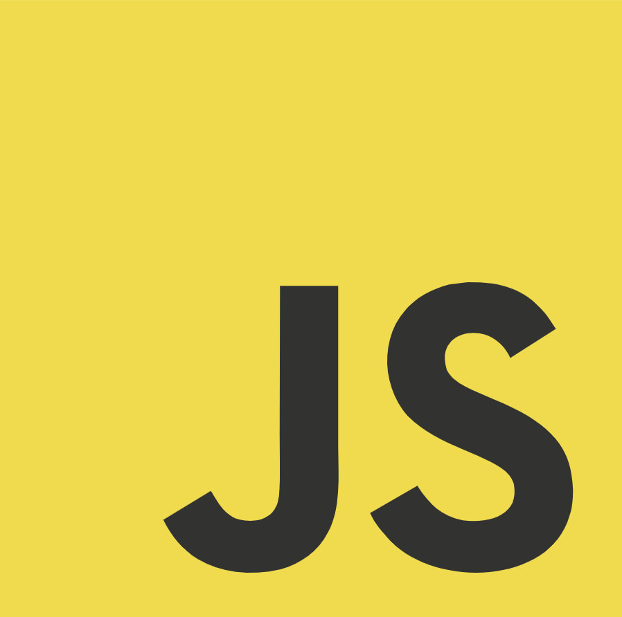
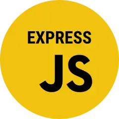
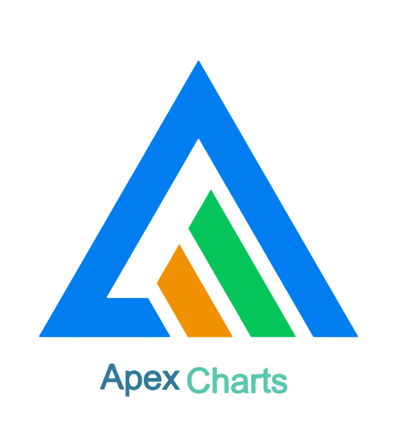
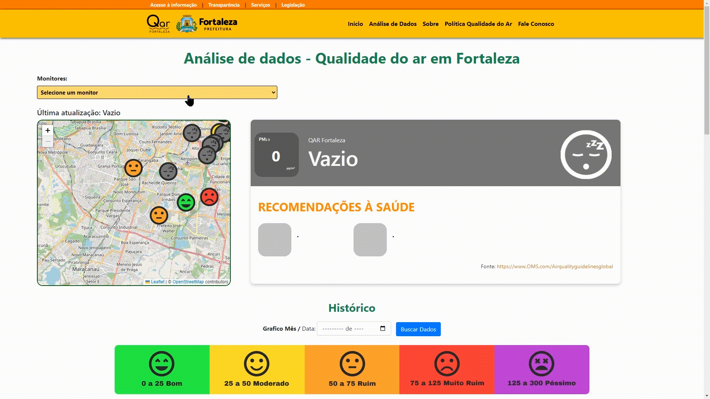

# Projeto de Monitoramento da Qualidade do Ar

## Descrição

Este projeto foi desenvolvido por bolsistas do Programa Juventude Digital, uma política pública da Prefeitura de Fortaleza coordenada pela Fundação de Ciência, Tecnologia e Inovação de Fortaleza (CITINOVA). O programa visa estimular a energia criativa, a difusão do conhecimento científico e o desenvolvimento de novas tecnologias por meio de políticas públicas que ofereçam soluções para problemas urbanos e promovam o bem-estar da população.

A aplicação foi desenvolvida em Node.js utilizando o framework Express para criar uma API RESTful, que se conecta a um banco de dados MongoDB. O objetivo principal é monitorar a qualidade do ar, especificamente os níveis de poluentes PM2.5 e PM10, através da coleta e agregação de dados em tempo real.

A aplicação realiza requisições ao banco de dados e exibe indicadores visuais dinâmicos, utilizando a biblioteca ApexCharts.js para gerar gráficos interativos que mostram a evolução dos níveis de poluição ao longo do tempo. Além dos gráficos, o projeto inclui um mapa com marcadores que indicam a localização dos monitores de qualidade do ar, atualizados dinamicamente conforme os níveis de cada poluente. Os marcadores exibem pop-ups com informações detalhadas quando clicados, permitindo uma análise visual intuitiva da qualidade do ar em diferentes áreas. O sistema também fornece a data e hora do último registro coletado, garantindo a precisão e a atualização em tempo real dos dados apresentados.

## Funcionalidades Principais

- Monitoramento em tempo real dos níveis de poluentes (PM2.5 e PM10).
- Exibição de gráficos interativos para análise de dados históricos.
- Mapa dinâmico com marcadores que mostram os níveis de poluentes em diferentes locais.
- Atualização automática dos dados e exibição da última data e hora do registro coletado.

## Tecnologias Utilizadas

- **Frontend:** javaScript, CSS3, HTML4, Bootstrap



- **Backend:** Node.js, Express.js



- **Banco de Dados:**  MongoDB


- **Bibliotecas:** ApexCharts.JS, Leaflet



## Pré-requisitos

- Node.js (v12 ou superior)
- npm (v6 ou superior)
- MongoDB (local ou remoto)

## Instalação

Para instalar e configurar o projeto, siga os passos abaixo:

1. Clone o repositório:
    ```bash
    git clone https://github.com/seu-usuario/seu-repositorio.git
    cd seu-repositorio
    ```

2. Instale as dependências:
    ```bash
    npm install
    ```

3. Configure as variáveis de ambiente:
    - Crie um arquivo `.env` na raiz do projeto.
    - Adicione a variável `MONGO_URI` com a URI do seu banco de dados MongoDB.
    - Crie o  arquivo `mongoose.js` com a conexão do seu banco de dados.

4. Inicie o servidor:
    ```bash
    npm start
    ```

## Uso

Após iniciar o servidor, a aplicação estará disponível em `http://localhost:3000`.

### Rotas da API

- **GET /dadosMapa**: Rota para dados do mapa.
- **GET /dados**: Rota para dados para gerar o primeiro Gráfico da página de Análise de dados.
- **GET /dados2**: Segundo gráfico da página de Análise de dados.
- **GET /dados3**: Terceiro Gráfico da página de Análise de dados.
- **GET /addosContainer**: Retorna os dados mais recentes de qualidade do ar para o monitor especificado selecionado na página de Análise de dados .

## Demonstração

Veja abaixo alguns exemplos de gráficos e indicadores do Projeto:





## Licença

Este projeto está licenciado sob a Licença MIT. Veja o arquivo [LICENSE](./LICENSE) para mais detalhes.
